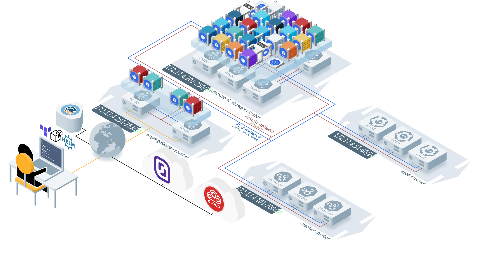
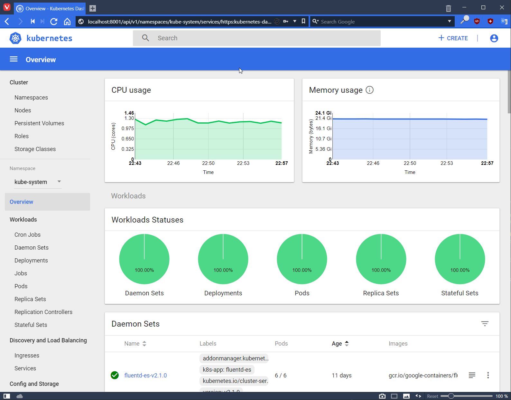

[](https://bestpractices.coreinfrastructure.org/projects/2188)


---

Saltstack-Kubernetes is an open source Kubernetes cluster deployment platform which aims to evaluate and run Cloud Native Applications like those registered in the [CNCF landscape](https://landscape.cncf.io).
Server provisionning is managed using [Terraform](https://www.terraform.io) with a primarly target on low-cost Cloud providers like [Scaleway](https://scaleway.com) and [Hetzner](https://hetzner.com/cloud).
Kubernetes cluster deployment is managed using [Saltstack](https://saltstack.com) to deploy the various software binaries, configuration files and cloud native applications required to operate.

---

## Solution design



The solution design carries the following requirements:

1. **Cloud provider agnostic**: Works similarly on any clouds
2. **Networking privacy**: All intra-cluster communications are TLS encrypted, pod network is encrypted, Firewall is enabled by default.
2. **Cluster security**: Node security and RBAC are enabled by default
4. **Public endpoint**: Leverage two servers stanting as edge gateway and allow the use of a single redudant Public IP address
5. **Secure admin network**: Establish a private Mesh VPN between all servers
6. **Composable CRI**: Support various Container Runtime Interface plugins (see: [Features](./docs/features.md))
7. **Composable CNI**: Support various Container Network Interface plugins (see: [Features](./docs/features.md))
8. **Converged Storage**: Persistent storage provided by cluster nodes
9. **API driven DNS**: DNS records are managed just-in-time during the deployment
10. **Stable**: Only leverage stable versions of software components

---

## Major components versions

<table>
  <tr>
    <th>Cloud provider</th>
    <th>DNS provider</th>
    <th>Kubernetes version</th>
    <th>Container runtime</th>
    <th>Container network</th>
  </tr>
  <tr>
    <td><ul><li><b>hetzner</b></li><li>scaleway</li></ul></td>
    <td><ul><li><b>cloudflare</b></li></ul></td>
    <td><ul><li>1.10.6</li><li>1.11.3</li><li>1.12.4</li><li>1.13.3</li><li>1.13.4</li><li>1.14.3<li>1.15.5</li><li><b>1.16.3</b></li></ul></td>
    <td><ul><li><b>docker 18.09.8</b></li><li>containerd 1.2.6</li><li>cri-o 1.15</li></ul></td>
    <td><ul><li><b>cni 0.7.5</b></li><li>calico 3.10.0</li><li>canal 3.2.1 (flannel 0.9.1)</li><li>flannel 0.1.0</li><li>weave 2.5.1</li><li>Cillium 1.30.0</li></ul></td>
  </tr>
</table>

* Default: **bold**

---

## Quick start

### Pre-requisits

Before starting check that following requirements are met:

* [ ] Register a public domain name
* [ ] Associate the domain name with [Cloudflare (Free)](https://www.cloudflare.com)
* [ ] Register with the cloud provider of your choice. Expect 100$ for a full month (i.e [Scaleway](https://scaleway.com), [Hetzner](https://hetzner.com/cloud))
* [ ] Setup the `terraform/terraform.tfvars` with your appropriate credentials and configuration using this [Example](./terraform/terraform.tfvars.example)
* [ ] Setup the `srv/pillar/cluster_config.sls` with your appropriate credentials and configuration using this [Example](./srv/pillar/cluster_config.sls.example)
  * Use this [guide](./docs/password.md) to customize the various credentials.
* [ ] Install the [required tools](./docs/prerequisits.md) (i.e. terraform, jq, wireguard-tools, etc.)
* [ ] Create the SSH key required to send commands to the servers.


> **Notice**: The configuration files are recorded in the `.gitignore` file to avoid the accidental uploads on the Web.

### Server creation 

Once the requirements are met, use the following command lines instanciate the server and the appropriate dns records.

```bash
cd terrafrom/
terraform init
terraform plan
terraform apply --parallelism 3
```

14 servers are instanciated by default. Terraform task parallelism is constrained in order to contraint the load on the cloud provider API. 

At the end of the process a similar output should be displayed, listing all the generated servers and associated IP adresses.

```text
Outputs:

hostnames = [
    proxy01,
    proxy02,
    etcd01,
    etcd02,
    etcd03,
    master01,
    master02,
    master03,
    node01,
    node02,
    node03,
    node04,
    node05,
    node06
]

...

vpn_ips = [
    172.17.4.251,
    172.17.4.252,
    172.17.4.51,
    172.17.4.52,
    172.17.4.53,
    172.17.4.101,
    172.17.4.102,
    172.17.4.103,
    172.17.4.201,
    172.17.4.202,
    172.17.4.203,
    172.17.4.204,
    172.17.4.205,
    172.17.4.206
]
```

### Kubernetes cluster deployment

The Kubernetes cluster deployment is acheived by connecting to the **salt-master** server (i.e proxy01) to execute the salt states.

This can be acheived using the following one-liner...

```bash
ssh root@proxy01.example.com -C "salt '*' state.apply"
```

... Or by opening first a SSH session to get benefit of the salt state output coloring.

```bash
ssh root@proxy01.example.com

root@proxy01 ~ # salt '*' state.apply
```

---

## Accessing

> **Replace** example.com" with the "public-domain" value from the salt pillar.

Retrieve the admin user token stored in the salt pillar (i.e /srv/pillar/cluster_config.sls).

Install [kubectl](https://kubernetes.io/docs/tasks/tools/install-kubectl).

Download the Kubernetes cluster CA certificate.

```bash
export CLUSTER_DOMAIN="example.com"

mkdir -p ~/.kube/ssl/${CLUSTER_DOMAIN}
scp root@proxy01.${CLUSTER_DOMAIN}:/etc/kubernetes/ssl/ca.pem ~/.kube/ssl/${CLUSTER_DOMAIN}/
```

Create the kubectl configuration file.

```bash
export CLUSTER_TOKEN=mykubernetestoken
export CLUSTER_NAME="example"
export KUBECONFIG="~/.kube/config"

kubectl config set-cluster ${CLUSTER_NAME} \
--server=https://kubernetes.${CLUSTER_DOMAIN}:6443 \
--certificate-authority=~/.kube/ssl/${CLUSTER_DOMAIN}/ca.pem

kubectl config set-credentials admin-${CLUSTER_NAME} \
--token=${CLUSTER_TOKEN}

kubectl config set-context ${CLUSTER_NAME} \
--cluster=${CLUSTER_NAME} \
--user=admin-${CLUSTER_NAME}

kubectl config use-context ${CLUSTER_NAME}
```

### Kubernetes cluster access

Check the Kubernetes cluster component health.

```bash
kubectl get componentstatus

NAME                 STATUS    MESSAGE              ERROR
etcd-2               Healthy   {"health": "true"}
etcd-1               Healthy   {"health": "true"}
controller-manager   Healthy   ok
scheduler            Healthy   ok
etcd-0               Healthy   {"health": "true"}
```

Check the Kubernetes cluster nodes status.

```bash
kubectl get nodes

NAME       STATUS   ROLES          AGE   VERSION
master01   Ready    master         11d   v1.12.1
master02   Ready    master         11d   v1.12.1
master03   Ready    master         11d   v1.12.1
node01     Ready    node           11d   v1.12.1
node02     Ready    node           11d   v1.12.1
node03     Ready    node           11d   v1.12.1
node04     Ready    node           11d   v1.12.1
node05     Ready    node           11d   v1.12.1
node06     Ready    node           11d   v1.12.1
proxy01    Ready    ingress,node   11d   v1.12.1
proxy02    Ready    ingress,node   11d   v1.12.1
```

Retreive the URLs protected by the Kube-APIserver.

```bash
kubectl cluster-info

Kubernetes master is running at https://kubernetes.example.com:6443
Elasticsearch is running at https://kubernetes.example.com:6443/api/v1/namespaces/kube-system/services/elasticsearch-logging/proxy
Heapster is running at https://kubernetes.example.com:6443/api/v1/namespaces/kube-system/services/heapster/proxy
Kibana is running at https://kubernetes.example.com:6443/api/v1/namespaces/kube-system/services/kibana-logging/proxy
CoreDNS is running at https://kubernetes.example.com:6443/api/v1/namespaces/kube-system/services/kube-dns:dns/proxy
kubernetes-dashboard is running at https://kubernetes.example.com:6443/api/v1/namespaces/kube-system/services/https:kubernetes-dashboard:/proxy
Grafana is running at https://kubernetes.example.com:6443/api/v1/namespaces/kube-system/services/monitoring-grafana/proxy
InfluxDB is running at https://kubernetes.example.com:6443/api/v1/namespaces/kube-system/services/monitoring-influxdb:http/proxy

To further debug and diagnose cluster problems, use 'kubectl cluster-info dump'.
```

## Kubectl Proxy

The URLs returned by `kubectl cluster-info` are protected by a mutual TLS authentification. Meaning that direct access from your Web Browser is denied until you register the appropriate certificate and private key in it.

Prefer the `kubectl proxy` command which enables the access to URL protected by the Kube-APIServer.
Once launched. URLs are available from the **localhost** on the HTTP port 8001.

> e.g. http://localhost:8001/api/v1/namespaces/kube-system/services/kube-dns:dns/proxy



---

## Credits

This project is vastly inspired by the following projects:

* [Kubernetes-Saltstack](https://github.com/valentin2105/Kubernetes-Saltstack) from [@valentin2105](https://github.com/valentin2105)
* [hobby-kube](https://github.com/hobby-kube/provisionning)  from [@pstadler](https://github.com/pstadler)
* [Kubernetes The Hard Way](https://github.com/kelseyhightower/kubernetes-the-hard-way) from [@kelseyhightower](https://github.com/kelseyhightower)
* [Saltformula-Kubernetes](https://github.com/salt-formulas/salt-formula-kubernetes)
* [Kubernetes Icons](https://github.com/octo-technology/kubernetes-icons)