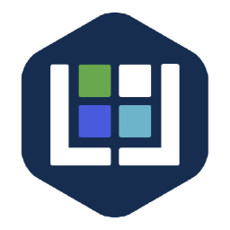
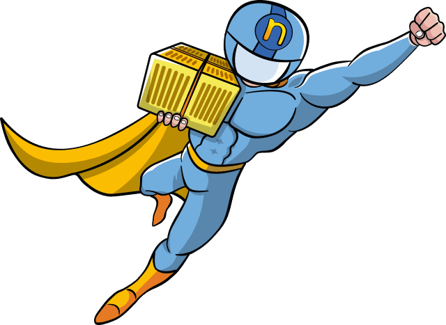
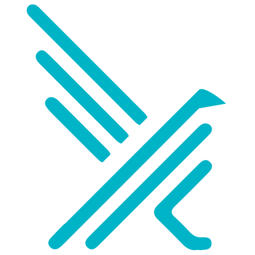
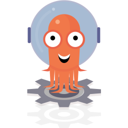
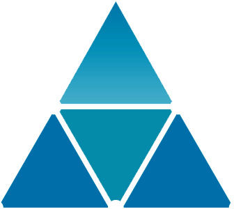

# Features

Project is designed to allow you compose the Kubernetes infrastructure that fits your needs.
Refer to the [pillar example](../srv/pillar/cluster_config.sls.example) to learn how to enable/disable and customize features.

## Website

Kubernetes applications demonstration and troubleshooting.

<table>
  <tr align='center'>
    <th align='center'>HTTP Troubleshooting</th>
    <th align='center'>microservices demo</th>
  </tr>
  <tr align='center'>
    <td align='center'><a ref='https://github.com/istio/istio/tree/master/samples/httpbin'>httpbin<a></td>
    <td align='center'><a ref='https://microservices-demo.github.io'>microservices-demo<a></td>
  </tr>
  <tr align='center'>
    <td align='center'></td>
    <td align='center'></td>
  </tr>
  <tr>
    <td align='center'>Server side HTTP requests troubleshooting tool</td>
    <td align='center'>Sock shop microservices architecture demo</td>
  </tr>
</table>

## Key Management

<table>
  <tr align='center'>
    <th align='center'>Identity & Access Management server</th>
    <th align='center'>Autentication proxy</th>
    <th align='center'>Autentication proxy sidecar injector</th>
  </tr>
  <tr align='center'>
    <td align='center'><a ref='https://github.com/keycloak/keycloak'>keycloak<a></td>
    <td align='center'><a ref='https://github.com/keycloak/keycloak-gatekeeper'>keycloak-gatekeeper<a></td>
    <td align='center'><a ref='https://github.com/stakater/ProxyInjector'>proxyinjector<a></td>
  </tr>
  <tr align='center'>
    <td align='center'></td>
    <td align='center'></td>
    <td align='center'></td>
  </tr>
  <tr>
    <td align='center'>Single Sign-on service</td>
    <td align='center'>Provide Authn and Authz to services that do not support OIDC/SAML</td>
    <td align='center'>Injects Keycloak Gatekeeper as sidecar to annotated deployments</td>
  </tr>
</table>

## Streaming & messaging

Solutions for Function as a Service.

<table>
  <tr align='center'>
    <th align='center' colspan=2>Messaging</th>
  </tr>
  <tr align='center'>
    <td align='center'><a ref='https://nats.io'>NATS<a></td>
  </tr>
  <tr align='center'>
    <td align='center'></td>
  </tr>
  <tr>
    <td align='center'>High speed non-persistent messaging</td>
  </tr>
</table>

## Serverless

Solutions for Function as a Service.

<table>
  <tr align='center'>
    <th align='center'>Simple Serverless platform</th>
    <th align='center'>Advanced Serverless platform</th>
    <th align='center'>Fast Serverless platform</th>
    <th align='center'>Datascience oriented Serverless platform</th>
  </tr>
  <tr align='center'>
    <td align='center'><a ref='https://kubeless.io'>Kubeless<a></td>
    <td align='center'><a ref='https://openfaas.com'>OpenFaaS<a></td>
    <td align='center'><a ref='https://fission.io'>Fission<a></td>
    <td align='center'><a ref='https://nuclio.io'>Nuclio<a></td>
  </tr>
  <tr align='center'>
    <td align='center'></td>
    <td align='center'></td>
    <td align='center'></td>
    <td align='center'></td>
  </tr>
  <tr>
    <td align='center'>Python, Node, Java, Go, Ruby, .Net core, Berlina
 <b>Trigger support:</b> NATS, Kafka, Cronjob, Kinesis and HTTP</td>
    <td align='center'>Any
 <b>Trigger support:</b> NATS, NATS Streamin, Kafka, Cronjob, Kinesis, Redis, MQTT, SQS, CloudEvents...</td>
    <td align='center'>Python, Node, Java, Go, Ruby, Binary/Scripts, Php 7, .NET 2.0, .NET, Perl
 <b>Trigger support:</b> NATS Streaming, Kafka</td>
    <td align='center'>Python, Node, Java, Go, .Net core, Bianry
 <b>Trigger support:</b>NATS, Kafka, Cronjob, Kinesis, RabbitMQ, v3ioStream, MQTT, EventHub and HTTP</td>
  </tr>
</table>

## Security & Compliance

Solutions for continuous security audit.

<table>
  <tr align='center'>
    <th align='center'>Threat detection engine</th>
    <th align='center'>Workload security assessment</th>
  </tr>
  <tr align='center'>
    <td align='center'><a ref='https://falco.org'>Falco<a></td>
    <td align='center'><a ref='https://www.octarinesec.com/solution-item/kube-scan/'>Kube-Scan<a></td>
  </tr>
  <tr align='center'>
    <td align='center'></td>
    <td align='center'></td>
  </tr>
  <tr>
    <td align='center'>Detects unexpected applicaton behavioir and alerts on theats at runtime.</td>
    <td align='center'>Scans the kubernetes workload and score the security of Kubernetes pods.</td>
  </tr>
</table>

## Continuous delivery

Solutions for software factory.

<table>
  <tr align='center'>
    <th align='center'>Continuous integration</th>
    <th align='center'>Container image registry</th>
    <th align='center'>Continuous delivery</th>
    <th align='center'>Workflow engine</th>
  </tr>
  <tr align='center'>
    <td align='center'><a ref='https://concourse.io'>Concourse<a></td>
    <td align='center'><a ref='https://github.com/goharbor/harbor'>Harbor<a></td>
    <td align='center'><a ref='https://spinnaker.io'>Spinnaker<a></td>
    <td align='center'><a ref='https://argoproj.github.io/argo/'>Argo<a></td>
  </tr>
  <tr align='center'>
    <td align='center'></td>
    <td align='center'></td>
    <td align='center'></td>
    <td align='center'></td>
  </tr>
  <tr>
    <td align='center'>Cloud Native Continuous Integration</td>
    <td align='center'>Secure image and Charts repository</td>
    <td align='center'>Cloud Native Continuous Delivery</td>
    <td align='center'>Cloud Native workflow engine for Kubernetes</td>
  </tr>
</table>

## Observability & Analysis

Solutions for monitoring, logging and tracing.

<table>
  <tr align='center'>
    <th align='center'>kube-dashboard</th>
    <th align='center' colspan='4'>kube-prometheus</th>
    <th align='center' colspan='3'>EFK</th>
    <th align='center'>Weave Scope</th>
    <th align='center'>Vistio</th>
  </tr>
  <tr align='center'>
    <td align='center'>Dashboard</td>
    <td align='center'>Prometheus-Operator</td>
    <td align='center'>Grafana</td>
    <td align='center'>Prometheus</td>
    <td align='center'>Node Exporter</td>
    <td align='center'>Kibana</td>
    <td align='center'>Elasticsearch</td>
    <td align='center'>Fluentd</td>
    <td align='center'>Weave Scope</td>
    <td align='center'>Vistio</td>
  </tr>
  <tr align='center'>
    <td align='center'></td>
    <td align='center'></td>
    <td align='center'></td>
    <td align='center'></td>
    <td align='center'></td>
    <td align='center'></td>
    <td align='center'></td>
    <td align='center'></td>
    <td align='center'></td>
    <td align='center'></td>
  </tr>
  <tr>
    <td align='center'>Cluster administration and monitoring</td>
    <td align='center'>Prometheus platform orchestration</td>
    <td align='center'>Metrics visualisation</td>
    <td align='center'>Metrics collection</td>
    <td align='center'>Metrics export</td>
    <td align='center'>Logs visualisation</td>
    <td align='center'>Logs aggregation</td>
    <td align='center'>Logs shipping</td>
    <td align='center'>Network visualisation</td>
    <td align='center'>Istio mesh visualisation</td>
  </tr>
</table>

## Ingress

Solutions to access hosted applications and cluster services.

<table>
  <tr align='center'>
    <th align='center' colspan='3'>Application endpoint</th>
    <th align='center'>Cluster endpoint</th>
  </tr>
  <tr align='center'>
    <td align='center'>Istio Ingress & Egress Gateway</td>
    <td align='center'>Traefik Ingress</td>
    <td align='center'>Nginx Ingress</td>
    <td align='center'>HApoxy</td>
  </tr>
  <tr align='center'>
    <td align='center'></td>
    <td align='center'></td>
    <td align='center'></td>
    <td align='center'></td>
  </tr>
  <tr>
    <td align='center'>Proxy & Reverse proxy</td>
    <td align='center'>Reverse proxy</td>
    <td align='center'>Reverse proxy</td>
    <td align='center'>Reverse proxy</td>
  </tr>
</table>

## Distributed database & storage

Solutions to provide storage persistence to stateful applications.

<table>
  <tr align='center'>
    <th align='center'>Backup & Recovery</th>
    <th align='center' colspan='7'>Distributed storage</th>
    <th>S3 compatible storage</th>
    <th align='center' colspan='2'>Distributed database</th>
  </tr>
  <tr align='center'>
    <td align='center'>Velero</td>
    <td align='center'>Rook</td>
    <td align='center'>Rook-Ceph</td>
    <td align='center'>Rook-EdgeFS</td>
    <td align='center'>Longhorn</td>
    <td align='center'>OpenEBS Cstor/Jiva</td>
    <td align='center'>OpenEBS Mayastor</td>
    <td align='center'>Portworx</td>
    <td align='center'>Minio</td>
    <td align='center'>Rook-CockroachDB</td>
    <td align='center'>Rook-YugabyteDB</td>
  </tr>
  <tr align='center'>
    <td align='center'></td>
    <td align='center'></td>
    <td align='center'></td>
    <td align='center'></td>
    <td align='center'></td>
    <td align='center'></td>
    <td align='center'></td>
    <td align='center'></td>
    <td align='center'></td>
    <td align='center'></td>
    <td align='center'></td>
  </tr>
  <tr>
    <td align='center'>Kubernetes cluster and workload backup & restore</td>
    <td align='center'>Storage infrastructure management</td>
    <td align='center'><b>Local</b> Block, Object and File storage</td>
    <td align='center'><b>Geo-Distributed</b> Block, Object and File storage</td>
    <td align='center'><b>Local</b> Block storage</td>
    <td align='center'><b>Local</b> Block storage</td>
    <td align='center'><b>Local</b> NVME/NVMF Block storage</td>
    <td align='center'><b>Geo-Distributed</b> Block and File storage</td>
    <td align='center'>Object storage</td>
    <td align='center'>Distributed SQL database</td>
    <td align='center'>Distributed SQL database</td>
  </tr>
</table>

## Service Mesh and Discovery

Solution to manage micro-services interconnexions and service discovery at scale.

<table>
  <tr align='center'>
    <th align='center' colspan='2'>Service Mesh</th>
    <th align='center'>Service Discovery</th>
  </tr>
  <tr align='center'>
    <td align='center'>Istio</td>
    <td align='center'>Envoy</td>
    <td align='center'>CoreDNS</td>
  </tr>
  <tr align='center'>
    <td align='center'></td>
    <td align='center'></td>
    <td align='center'></td>
  </tr>
  <tr>
    <td align='center'>Meshed pod control plane management</td>
    <td align='center'>Meshed pod data plane</td>
    <td align='center'>Dynamic name resolution</td>
  </tr>
</table>

## Container Network

Solutions to manage container networking and traffic policies.

<table>
  <tr align='center'>
  <th align='center' colspan='1'>Library</th>
    <th align='center' colspan='5'>Plugin</th>
  </tr>
  <tr align='center'>
    <td align='center'>CNI</td>
    <td align='center'>Flannel</td>
    <td align='center'>Calico</td>
    <td align='center'>Canal</td>
    <td align='center'>Cilium</td>
    <td align='center'>Weave net</td>
  </tr>
  <tr align='center'>
    <td align='center'></td>
    <td align='center'></td>
    <td align='center'></td>
    <td align='center'></td>
    <td align='center'></td>
    <td align='center'></td>
  </tr>
  <tr>
    <td align='center'>Network library</td>
    <td align='center'>L2 vxlan without security policy</td>
    <td align='center'>L3 BGP with security policy (iptables)</td>
    <td align='center'>L2 vxlan with security policy (iptables)</td>
    <td align='center'>L2 vxlan with security policy (BPF)</td>
    <td align='center'>L2 vxlan with security policy (iptables)</td>
  </tr>
</table>

## Container Runtime

Solutions to run containerized applications.

<table>
  <tr align='center'>
  <th align='center' colspan='1'>Build and run</th>
    <th align='center' colspan='3'>Run only</th>
  </tr>
  <tr align='center'>
    <td align='center'>Docker</td>
    <td align='center'>Containerd</td>
    <td align='center'>Cri-O</td>
  </tr>
  <tr align='center'>
    <td align='center'></td>
    <td align='center'></td>
    <td align='center'></td>
  </tr>
  <tr>
    <td align='center'></td>
    <td align='center'></td>
    <td align='center'></td>
  </tr>
</table>

## Perimeter security

Solutions to control and protect the cluster exchange on the Web.

<table>
  <tr align='center'>
    <th align='center' colspan='2'>Protection machines</th>
    <th align='center' colspan='2'>Server management</th>
  </tr>
  <tr align='center'>
    <td align='center'>UFW</td>
    <td align='center'>IP Tables</td>
    <td align='center'>Tinyproxy</td>
    <td align='center'>Cloudflare</td>
  </tr>
  <tr align='center'>
    <td align='center'></td>
    <td align='center'></td>
    <td align='center'></td>
    <td align='center'></td>
  </tr>
  <tr>
    <td align='center'>Simplified iptables administration</td>
    <td align='center'>Stateful network firewall</td>
    <td align='center'>Outboud web filtering</td>
    <td align='center'>DDOS web protection</td>
  </tr>
</table>

## Cloud provider

Cloud infrastructure providers.

<table>
  <tr align='center'>
    <th align='center' colspan='3'>IaaS</th>
  </tr>
  <tr align='center'>
    <td align='center'>Scaleway</td>
    <td align='center'>Hetzner</td>
    <td align='center'>Azure</td>
  </tr>
  <tr align='center'>
    <td align='center'></td>
    <td align='center'></td>
    <td align='center'></td>
  </tr>
  <tr>
    <td align='center'>Low-cost Atom & ARM server</td>
    <td align='center'>Low-cost Xeon server</td>
    <td align='center'>Xeon server</td>
  </tr>
</table>

## Domain Name Service provider

Managed DNS services.

<table>
  <tr align='center'>
    <th align='center' colspan='2'>Name resolution</th>
  </tr>
  <tr align='center'>
    <td align='center'>Cloudflare</td>
    <td align='center'>OVH</td>
  </tr>
  <tr align='center'>
    <td align='center'></td>
    <td align='center'></td>
  </tr>
  <tr>
    <td align='center'>API driven DNS service with DDOS protection</td>
    <td align='center'>API driven DNS service</td>
  </tr>
</table>

## Configuration management & orchestration

Tools to instanciate the various cluster components

<table>
  <tr align='center'>
    <th align='center'>Server orchestration</th>
    <th align='center'>Server management</th>
    <th align='center'>Container orchestration</th>
  </tr>
  <tr align='center'>
    <td align='center'>Terraform</td>
    <td align='center'>SaltStack</td>
    <td align='center'>Kubernetes</td>
  </tr>
  <tr align='center'>
    <td align='center'></td>
    <td align='center'></td>
    <td align='center'></td>
  </tr>
  <tr>
    <td align='center'>Create and prepare server for Salt Kubernetes installation</td>
    <td align='center'>Install Kubernetes cluster and addons</td>
    <td align='center'>Deploy and manage contairized application</td>
  </tr>
</table>