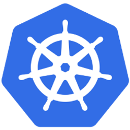
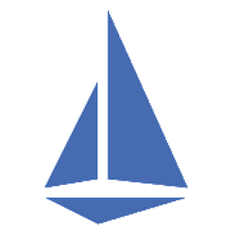
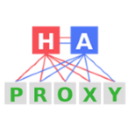
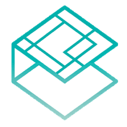
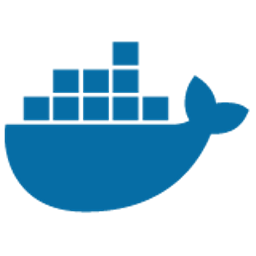
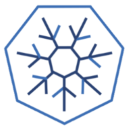
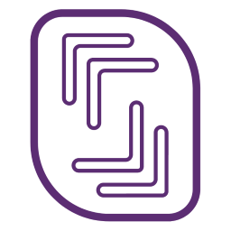
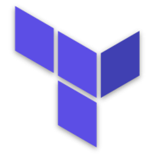
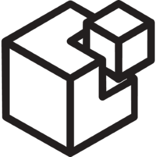

# Features

## Observability & Analysis

Solutions for monitoring, logging and tracing

<table>
  <tr align='center'>
    <th align='center'>kube-dashboard</th>
    <th align='center' colspan='3'>kube-prometheus</th>
    <th align='center' colspan='3'>EFK</th>
    <th align='center'>Weave Scope</th>
  </tr>
  <tr align='center'>
    <td align='center'>Dashboard</td>
    <td align='center'>Grafana</td>
    <td align='center'>Prometheus</td>
    <td align='center'>Node Exporter</td>
    <td align='center'>Kibana</td>
    <td align='center'>Elasticsearch</td>
    <td align='center'>Fluentd</td>
    <td align='center'>Weave Scope</td>
  </tr>
  <tr align='center'>
    <td align='center'></td>
    <td align='center'></td>
    <td align='center'></td>
    <td align='center'></td>
    <td align='center'></td>
    <td align='center'></td>
    <td align='center'></td>
    <td align='center'></td>
  </tr>
  <tr>
    <td align='center'>Cluster administration and monitoring</td>
    <td align='center'>Metrics visualisation</td>
    <td align='center'>Metrics collection</td>
    <td align='center'>Metrics export</td>
    <td align='center'>Logs visualisation</td>
    <td align='center'>Logs aggregation</td>
    <td align='center'>Logs shipping</td>
    <td align='center'>Network visualisation</td>
  </tr>
</table>

## Inbound internet access

Solutions to access hosted applications and cluster services.

<table>
  <tr align='center'>
    <th align='center' colspan='3'>Application endpoint</th>
    <th align='center'>Cluster endpoint</th>
  </tr>
  <tr align='center'>
    <td align='center'>Istio Ingress & Egress Gateway</td>
    <td align='center'>Traefik Ingress</td>
    <td align='center'>Nginx Ingress</td>
    <td align='center'>HApoxy</td>
  </tr>
  <tr align='center'>
    <td align='center'></td>
    <td align='center'></td>
    <td align='center'></td>
    <td align='center'></td>
  </tr>
  <tr>
    <td align='center'>Proxy & Reverse proxy</td>
    <td align='center'>Reverse proxy</td>
    <td align='center'>Reverse proxy</td>
    <td align='center'>Reverse proxy</td>
  </tr>
</table>

## Persistent storage

Solutions to provide storage persistence to stateful applications.

<table>
  <tr align='center'>
    <th align='center' colspan='3'>Distributed storage</th>
    <th align='center'>Distributed database</th>
  </tr>
  <tr align='center'>
    <td align='center'>Rook</td>
    <td align='center'>Rook-Ceph</td>
    <td align='center'>Rook-Minio</td>
    <td align='center'>Rook-CockroachDB</td>
  </tr>
  <tr align='center'>
    <td align='center'></td>
    <td align='center'></td>
    <td align='center'></td>
    <td align='center'></td>
  </tr>
  <tr>
    <td align='center'>Storage infrastructure deployment</td>
    <td align='center'>Block, Object and File storage</td>
    <td align='center'>Object storage</td>
    <td align='center'>Distributed SQL database</td>
  </tr>
</table>

## Service Mesh and Discovery

Solution to manage micro-services interconnexions and service discovery at scale.

<table>
  <tr align='center'>
    <th align='center' colspan='2'>Service Mesh</th>
    <th align='center'>Service Discovery</th>
  </tr>
  <tr align='center'>
    <td align='center'>Istio</td>
    <td align='center'>Envoy</td>
    <td align='center'>CoreDNS</td>
  </tr>
  <tr align='center'>
    <td align='center'></td>
    <td align='center'></td>
    <td align='center'></td>
  </tr>
  <tr>
    <td align='center'>Meshed pod control plane management</td>
    <td align='center'>Meshed pod data plane</td>
    <td align='center'>Dynamic name resolution</td>
  </tr>
</table>

## Container Network

Solutions to manage container networking and traffic policies.

<table>
  <tr align='center'>
  <th align='center' colspan='1'>Library</th>
    <th align='center' colspan='5'>Plugin</th>
  </tr>
  <tr align='center'>
    <td align='center'>CNI</td>
    <td align='center'>Flannel</td>
    <td align='center'>Calico</td>
    <td align='center'>Canal</td>
    <td align='center'>Cilium</td>
    <td align='center'>Weave net</td>
  </tr>
  <tr align='center'>
    <td align='center'></td>
    <td align='center'></td>
    <td align='center'></td>
    <td align='center'></td>
    <td align='center'></td>
    <td align='center'></td>
  </tr>
  <tr>
    <td align='center'>Network library</td>
    <td align='center'>L2 vxlan without security policy</td>
    <td align='center'>L3 BGP with security policy (iptables)</td>
    <td align='center'>L2 vxlan with security policy (iptables)</td>
    <td align='center'>L2 vxlan with security policy (BPF)</td>
    <td align='center'>L2 vxlan with security policy (iptables)</td>
  </tr>
</table>

## Container Runtime

Solutions to run containerized applications.

<table>
  <tr align='center'>
  <th align='center' colspan='1'>Build and run</th>
    <th align='center' colspan='3'>Run only</th>
  </tr>
  <tr align='center'>
    <td align='center'>Docker</td>
    <td align='center'>Containerd</td>
    <td align='center'>RKT</td>
    <td align='center'>Cri-O</td>
  </tr>
  <tr align='center'>
    <td align='center'></td>
    <td align='center'></td>
    <td align='center'></td>
    <td align='center'></td>
  </tr>
  <tr>
    <td align='center'>Network library</td>
    <td align='center'>L2 vxlan without security policy</td>
    <td align='center'>L3 BGP with security policy (iptables)</td>
    <td align='center'>L2 vxlan with security policy (iptables)</td>
  </tr>
</table>

## Perimeter security

Solutions to control and protect the cluster exchange on the Web.

<table>
  <tr align='center'>
    <th align='center' colspan='2'>Protection machines</th>
    <th align='center' colspan='2'>Server management</th>
  </tr>
  <tr align='center'>
    <td align='center'>UFW</td>
    <td align='center'>IP Tables</td>
    <td align='center'>Tinyproxy</td>
    <td align='center'>Cloudflare</td>
  </tr>
  <tr align='center'>
    <td align='center'></td>
    <td align='center'></td>
    <td align='center'></td>
    <td align='center'></td>
  </tr>
  <tr>
    <td align='center'>Simplified iptables administration</td>
    <td align='center'>Stateful network firewall</td>
    <td align='center'>Outboud web filtering</td>
    <td align='center'>Inbound web protection</td>
  </tr>
</table>

## Cloud provider

Cloud infrastructure providers.

<table>
  <tr align='center'>
    <th align='center' colspan='3'>IaaS</th>
  </tr>
  <tr align='center'>
    <td align='center'>Scaleway</td>
    <td align='center'>Hetzner</td>
    <td align='center'>Azure</td>
  </tr>
  <tr align='center'>
    <td align='center'></td>
    <td align='center'></td>
    <td align='center'></td>
  </tr>
  <tr>
    <td align='center'>Low-cost Atom & ARM server</td>
    <td align='center'>Low-cost Xeon server</td>
    <td align='center'>Xeon server</td>
  </tr>
</table>

## DNS provider

Managed DNS services.

<table>
  <tr align='center'>
    <th align='center' colspan='1'>Name resolution</th>
  </tr>
  <tr align='center'>
    <td align='center'>Cloudflare</td>
  </tr>
  <tr align='center'>
    <td align='center'></td>
  </tr>
  <tr>
    <td align='center'>API driven DNS service</td>
  </tr>
</table>

## Configuration management & orchestration

Tools to instanciate the various cluster components

<table>
  <tr align='center'>
    <th align='center'>Server orchestration</th>
    <th align='center'>Server management</th>
    <th align='center'>Container orchestration</th>
  </tr>
  <tr align='center'>
    <td align='center'>Terraform</td>
    <td align='center'>SaltStack</td>
    <td align='center'>Kubernetes</td>
  </tr>
  <tr align='center'>
    <td align='center'></td>
    <td align='center'></td>
    <td align='center'></td>
  </tr>
  <tr>
    <td align='center'>Create and prepare server for Salt Kubernetes installation</td>
    <td align='center'>Install Kubernetes cluster and addons</td>
    <td align='center'>Deploy and manage contairized application</td>
  </tr>
</table>